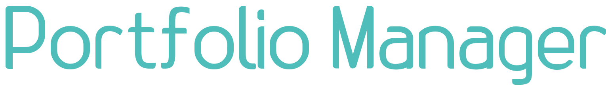

   
    
    <h3>A Minimalistic Asset Manager</h3>
  

   
  

## Important Note

This app is currently under construction and therefore not available. Come back soon.

## Live Version

Find a demo application of this app [here](https://hendriktreuner.me/portfolio-manager)

## Description

A portfolio tracker for people who always wanted to possess and have control over their data.
This website is just for modification of your data. We don't store anything. 
Just upload your portfolio file, work on it, save the changes and download an updated version of your file.

We focus on a minimalistic design so you can focus on the important thing: Your money and assets

## Functionality

- Expense Tracker: Add and Remove Expenses
- Uploader: Upload your portfolio file to modify it
- Downloader: Download the new version of your portfolio file
- Overview: Get a real overall feel of how your asset are doing
- Portfolio: Track your stocks and see how they are performing
- Accounts: Keep track of your bank accounts

## License

MIT License
